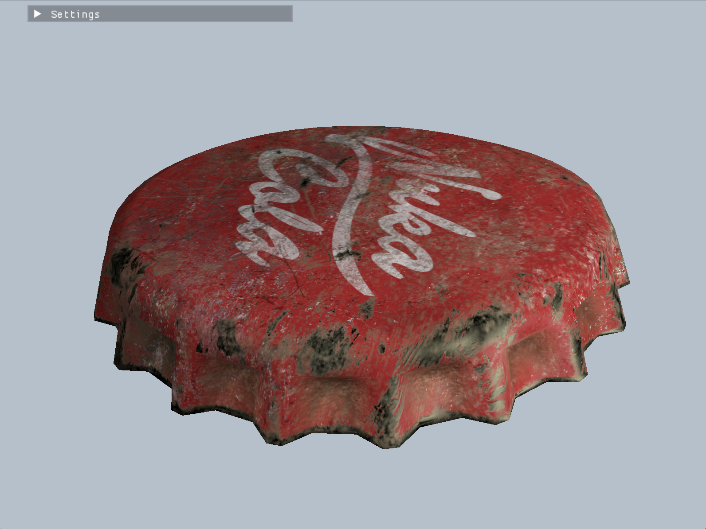
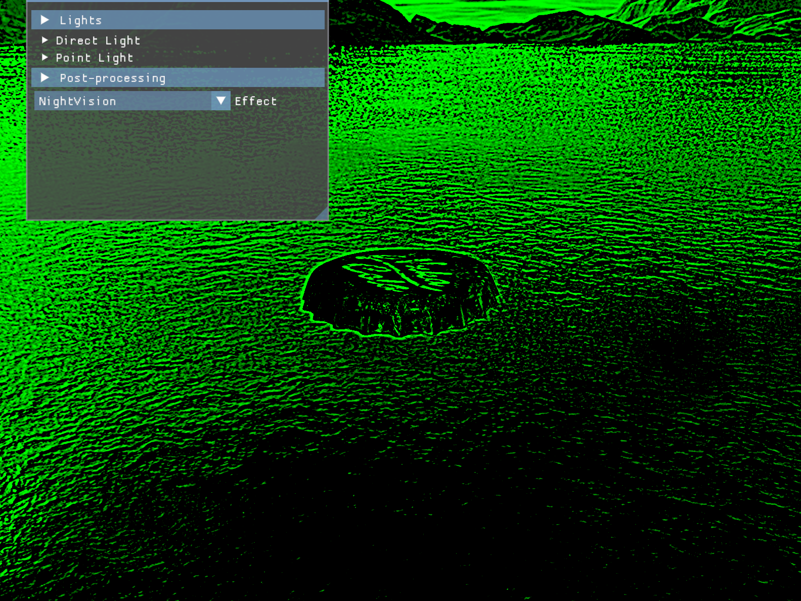

# ZzRenderer
An OpenGL 3D PBR Graphics Renderer 

+ **Model loading** from .obj files, decomposing them into meshes and materials using Assimp.
+ Implemented directional and point lights to achieve immersive scene lighting, and implemented **cascaded shadow mapping** for directional lights.
+ Enhanced visual details and lighting precision through **normal mapping** and **MSAA anti-aliasing**.
+ Improved renderer usability by implementing the **skybox** and multiple **post-processing effects**.
+ **Uniform Buffer Objects** (UBO): Optimized uniform variable management with UBOs, improving rendering performance and code organization.
+ Ensured good code structure, making the project well-organized, easy to modify, and extend.
+ ImGui Menu Integration: Integrated ImGui for an interactive user interface, allowing real-time control over rendering parameters.

