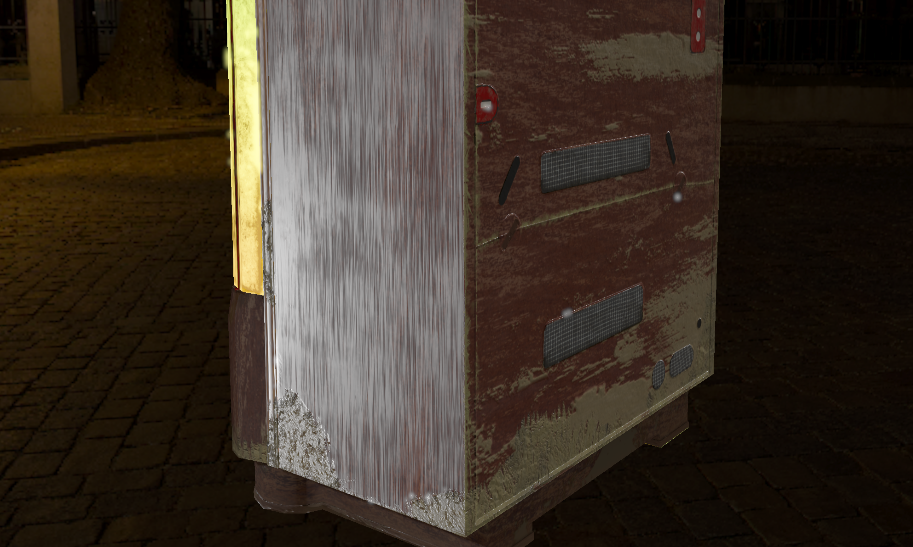

# ZzRenderer
An OpenGL 3D PBR Graphics Renderer 

## Rendering
+ Forward rendering
+ Cook-Torrance microfacet specular BRDF
+ Lambertian diffuse BRDF
+ Roughness-Metallic workflow
+ Normal mapping
+ Dynamic directional light, point lights and spot lights
+ Directional Cascade Shadow maps
+ HDR / linear lighting
+ Skybox
+ Tone mapping
+ Gamma correction

### to-do:
+ Point light shadow
+ Image based rendering
+ Clustered forward renderer
+ Deferred rendering

## Post Processing
+ HDR Bloom
+ FXAA, MSAA

### to-do:
+ Depth of field bokeh

## Dependencies
+ OpenGL
+ glfw3
+ glad
+ glm
+ stb_image
+ assimp

